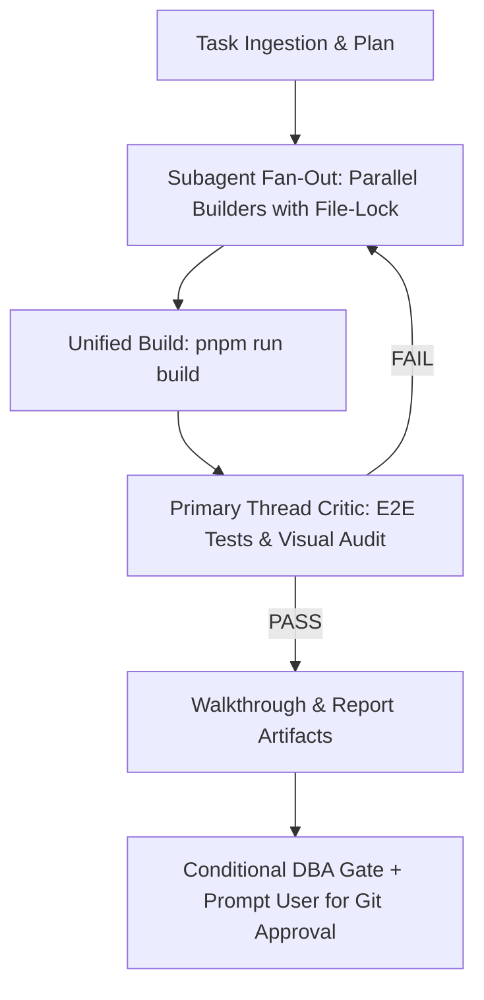

# AGENTS.md — Development Guidelines & Collaboration Protocol

Welcome to **BrgyConnect** (`ag-brgy-connect`). This document defines the operational protocol, architectural standards, and workflow rules for AI agents and subagents working in this codebase.

---

## 🤝 1. Collaboration & User Pairing Philosophy

1. **5-Node Multi-Agent Lifecycle Protocol (MANDATORY)**:
   ```mermaid
   graph TD
       A["1. 🎯 Product Strategist"] -->|Feature Scope & Requirements| B["2. 🎨 UI/UX Designer"]
       B -->|Clarify / Iterate if Blocked| A
       B -->|Approved Design Spec & Handoff| C["3. ⚡ Engineering Hub"]
       C -->|Parallel Builders with File-Lock| C_Test["Verified Build & Screenshots"]
       C_Test -->|Schema changes?| DBA_Check{"Migration files changed?"}
       DBA_Check -->|YES: Full Audit| D["4. 🗄️ DBA & Cloud Architect"]
       DBA_Check -->|NO: Awareness-only| UserGate["Prompt User for Git Approval"]
       C_Test -->|Screenshots & Walkthrough| E["5. 📢 Poster / Community Lead"]
       D -->|RLS, Indexes & Security Sign-Off| UserGate
       UserGate -->|User Confirms| GitPush["Git Commit & Push to Main"]
       GitPush -->|Release Broadcast| E_Live["Poster Publishes"]
       E_Live -->|Citizen Engagement Insights| A
   ```
   - **Step 1 (Product -> UX)**: Product Strategist defines citizen problem, feature requirements, and handoff (`01_product_brief.md`).
   - **Step 2 (UX -> Engineering)**: UI/UX Designer reviews, specs out responsive UI/UX, validates usability with Product, and passes to Engineering Hub (`02_design_spec.md`).
   - **Step 3 (Engineering Hub Execution & Engine Choice)**: Lead Architect (3A) selects the optimal execution engine:
     - **Engine 1: Parallel Builder Fan-Out with File-Locking (Default)**: For iterative features, UI/UX polish, and targeted SSR changes. Spawns 2–6 Flash-tier builders with disjoint file locks.
     - **Engine 2: `/teamwork-preview` Swarm Engine**: For massive greenfield subsystems, standalone microservices, or complex algorithms requiring a 10+ agent swarm.
     - In both cases, **3C Independent QA Critic** executes unified build checks (`pnpm run build`), runs automated Puppeteer E2E tests, and verifies screenshots before proceeding.
   - **Step 4 (Conditional DBA Gate + Poster)**: If migration files were changed, DBA audit is mandatory and blocking. If UI-only, DBA is notified for awareness (non-blocking). Poster is always notified in parallel with screenshots.
   - **Step 5 (Git Gate)**: Engineering Hub prompts the user for explicit Git commit/push confirmation (after DBA sign-off if required).
   - **Step 6 (Release Broadcast)**: Once pushed to `main`, Poster finalizes and publishes community social media announcements.
   - **Step 7 (Retrospective Loop)**: Poster feeds citizen engagement insights back to Product Strategist for the next cycle.

2. **Explicit User Approval for Git (MANDATORY)**:
   - **NEVER** run `git commit` or `git push` automatically or silently.
   - For **schema-touching releases**: wait for DBA audit sign-off, verify build, present screenshots, then ask user for explicit confirmation.
   - For **UI-only releases**: verify build, present screenshots, then ask user for explicit confirmation (DBA notified for awareness, non-blocking).
   - Format approved commits using **Conventional Commits** (e.g. `feat(admin): scope user list by barangay unit and add role-aware navbar`).
3. **Hybrid Execution & Subagent Workflow**:
   - **Architectural Features & Audits**: Use planning mode + subagent fan-out (parallel builders) followed by a QA Critic verification subagent.
   - **Targeted Fixes & Quick Tweaks**: Execute directly with verification and zero regressions.
4. **High-Signal Communication & QA Proof**:
   - Present verification via concise markdown with clickable file links (e.g. [`src/routes/__root.tsx`](file:///Users/markhuelgas/Documents/antigravity/ag-brgy-connect/src/routes/__root.tsx)), structured **Pass/Fail tables**, and **high-resolution screenshot carousels**.
5. **Proactive & Solution-Oriented**:
   - Diagnose root causes directly instead of asking the user to troubleshoot.
   - When encountering ambiguities or high-impact trade-offs, proactively propose the cleanest architectural solution with rationale and utilize `/grill-me`.

---

## 🏗️ 2. Tech Stack & Architectural Conventions

* **Framework**: [TanStack Start](https://tanstack.com/start) (Full-stack SSR with Vite + Nitro engine)
* **Routing**: [TanStack Router](https://tanstack.com/router) (Strictly typed file-based routes in `src/routes/`)
* **Data Fetching & Server Functions**: TanStack Query + `createServerFn` with Zod input validation
* **Database & Auth**: [Supabase](https://supabase.com) PostgreSQL, Row-Level Security (RLS), and Session Cookie SSR
* **UI & Styling**: Tailwind CSS, Radix UI primitives, Lucide React icons, Sonner toast notifications
* **AI Resident Assistant**: Google GenAI (`@google/genai` Gemini SDK) in `src/server/aiChat.ts` with sliding-window rate limiting

### Critical Code & SSR Rules:
- **Type-Only React Imports**: Always use `import type { ReactNode } from 'react'` to avoid CJS/ESM module runtime errors in Vite SSR.
- **Defensive Data Handling**: Guard against nullable loader data (e.g., `const list = Route.useLoaderData() ?? []`) to prevent hydration crashes.
- **Server vs Client Boundaries**: Isolate database access and secret keys (`process.env.GEMINI_API_KEY`, `process.env.SUPABASE_SERVICE_ROLE_KEY`) inside server functions (`src/server/`).

---

## 🔄 3. Mandatory TDD & Subagent Workflow

Every task MUST follow the systematic Quality-Driven process defined in [`.agents/rules/tdd-workflow.md`](file:///Users/markhuelgas/Documents/antigravity/ag-brgy-connect/.agents/rules/tdd-workflow.md):



1. **Fan-Out Parallel Builders with File-Lock Protocol**:
   - Decompose multi-file features across dedicated builder subagents (`Model: 'flash'`).
   - **Each builder must have explicit file-level ownership.** No two builders may modify the same file. If overlap is unavoidable, one builder is primary owner; the other reports its changes as instructions to the orchestrator for sequential application.
   - Each subagent verifies its changes independently before reporting completion.
2. **High-Reasoning Orchestrator & Critic (Primary Thread)**:
   - The Orchestrator consolidates code from builders, runs unified build checks, and directly executes automated test scripts and visual verification.
   - Issues a formal `PASS` / `FAIL` verdict before presenting work.
3. **Zero Build Regressions**:
   - `npx --yes pnpm run build` must succeed with **0 TypeScript, Vite SSR, and Nitro compilation errors**.
4. **High-Signal Visual Artifacts**:
   - Save high-resolution verification screenshots to the artifact directory.
   - Update `walkthrough.md` and present structured Pass/Fail tables and screenshot carousels.
5. **Conditional DBA Gate**:
   - **Schema-touching releases** (new migrations, RLS changes): DBA audit is mandatory and blocking before Git.
   - **UI-only releases** (no migration files changed): DBA is notified for awareness only (non-blocking). Proceed directly to user Git approval.
   - Detection: `git diff --cached --name-only | grep -c 'supabase/migrations'`

---

## 🎨 4. UI/UX Design Intelligence & Consultation Protocol (MANDATORY FOR NODE 2)

**Node 2 (🎨 UI/UX Designer)** and all frontend engineering builders MUST actively consult and synthesize our specialized design intelligence stack before speccing or generating UI components, layouts, or interactions:

1. **`impeccable` (Paul Bakaus Design Language & Anti-Slop)**:
   - Enforce the craft floor: strictly ban generic AI tropes (no unstyled raw borders, no predictable purple/blue glows, no cookie-cutter bento boxes).
   - Apply deterministic playbooks (`/impeccable polish`, `/impeccable craft`, `/impeccable animate`).
   - Ensure distinct visual hierarchy, clear scanability, and authentic tactile micro-feedback.

2. **`taste-skill` (Leonxlnx Aesthetic Direction & Anti-Default Discipline)**:
   - Perform brief inference: always declare a **"Design Read"** (page kind, target audience, vibe keywords, aesthetic family) before coding.
   - Practice aesthetic restraint: eliminate repetitive LLM defaults and design specifically for the real civic/user scene.
   - Build content-first rhythm with strong typography hierarchy.

3. **`emil-design-eng` & `animate` (Emil Kowalski Design Engineering & Motion Physics)**:
   - Apply realistic spring physics, fluid entry/exit choreography, and spatial continuity.
   - Compound invisible details: tactile button feedback (`active:scale-95`, `active:bg-muted`), smooth hover transitions (150–200ms), and contextual loading feedback.
   - Guarantee minimum $44\times 44\text{px}$ touch targets on all interactive controls.

4. **`ui-ux-pro-max` (Design System & Color Tokens)**:
   - Query 84 styles, 192 color palettes (OKLCH tokens), 74 font pairings, and 98 UX guidelines tailored to the tech stack.
   - Enforce WCAG AAA contrast ratios ($>9.5:1$ on light/dark mode) and zero layout shifts ($\text{CLS} = 0.00$).

5. **`huashu-design` (5-Dimensional Studio Critique)**:
   - Apply 5-dimensional self-critique across Art Direction, Visual Hierarchy, Motion Continuity, Frontend Precision, and UX Copywriting.

6. **Dual-Barangay Scoping & Context**:
   - Support multi-tenant scoping for **Barangay Daine 1** and **Barangay Daine 2** across public feeds, official rosters, certificates, and admin consoles.

---

## ⚡ 5. TanStack Intent Guidance

<!-- intent-skills:start -->
# TanStack Intent - before editing files, run the matching guidance command.
tanstackIntent:
  - id: "@tanstack/devtools#devtools-app-setup"
    run: "pnpm dlx @tanstack/intent@latest load @tanstack/devtools#devtools-app-setup"
    for: "Install TanStack Devtools, pick framework adapter (React/Vue/Solid/Preact), register plugins via plugins prop, configure shell (position, hotkeys, theme, hideUntilHover, requireUrlFlag, eventBusConfig). TanStackDevtools component, defaultOpen, localStorage persistence."
  - id: "@tanstack/devtools#devtools-marketplace"
    run: "pnpm dlx @tanstack/intent@latest load @tanstack/devtools#devtools-marketplace"
    for: "Publish plugin to npm and submit to TanStack Devtools Marketplace. PluginMetadata registry format, plugin-registry.ts, pluginImport (importName, type), requires (packageName, minVersion), framework tagging, multi-framework submissions, featured plugins."
  - id: "@tanstack/devtools#devtools-plugin-panel"
    run: "pnpm dlx @tanstack/intent@latest load @tanstack/devtools#devtools-plugin-panel"
    for: "Build devtools panel components that display emitted event data. Listen via EventClient.on(), handle theme (light/dark), use @tanstack/devtools-ui components. Plugin registration (name, render, id, defaultOpen), lifecycle (mount, activate, destroy), max 3 active plugins. Two paths: Solid.js core with devtools-ui for multi-framework support, or framework-specific panels."
  - id: "@tanstack/devtools#devtools-production"
    run: "pnpm dlx @tanstack/intent@latest load @tanstack/devtools#devtools-production"
    for: "Handle devtools in production vs development. removeDevtoolsOnBuild, devDependency vs regular dependency, conditional imports, NoOp plugin variants for tree-shaking, non-Vite production exclusion patterns."
  - id: "@tanstack/devtools-event-client#devtools-bidirectional"
    run: "pnpm dlx @tanstack/intent@latest load @tanstack/devtools-event-client#devtools-bidirectional"
    for: "Two-way event patterns between devtools panel and application. App-to-devtools observation, devtools-to-app commands, time-travel debugging with snapshots and revert. structuredClone for snapshot safety, distinct event suffixes for observation vs commands, serializable payloads only."
  - id: "@tanstack/devtools-event-client#devtools-event-client"
    run: "pnpm dlx @tanstack/intent@latest load @tanstack/devtools-event-client#devtools-event-client"
    for: "Create typed EventClient for a library. Define event maps with typed payloads, pluginId auto-prepend namespacing, emit()/on()/onAll()/onAllPluginEvents() API. Connection lifecycle (5 retries, 300ms), event queuing, enabled/disabled state, SSR fallbacks, singleton pattern. Unique pluginId requirement to avoid event collisions."
  - id: "@tanstack/devtools-event-client#devtools-instrumentation"
    run: "pnpm dlx @tanstack/intent@latest load @tanstack/devtools-event-client#devtools-instrumentation"
    for: "Analyze library codebase for critical architecture and debugging points, add strategic event emissions. Identify middleware boundaries, state transitions, lifecycle hooks. Consolidate events (1 not 15), debounce high-frequency updates, DRY shared payload fields, guard emit() for production. Transparent server/client event bridging."
  - id: "@tanstack/devtools-vite#devtools-vite-plugin"
    run: "pnpm dlx @tanstack/intent@latest load @tanstack/devtools-vite#devtools-vite-plugin"
    for: "Configure @tanstack/devtools-vite for source inspection (data-tsd-source, inspectHotkey, ignore patterns), console piping (client-to-server, server-to-client, levels), enhanced logging, server event bus (port, host, HTTPS), production stripping (removeDevtoolsOnBuild), editor integration (launch-editor, custom editor.open). Must be FIRST plugin in Vite config. Vite ^6 || ^7 only."
  - id: "@tanstack/react-start#lifecycle/migrate-from-nextjs"
    run: "pnpm dlx @tanstack/intent@latest load @tanstack/react-start#lifecycle/migrate-from-nextjs"
    for: "Step-by-step migration from Next.js App Router to TanStack Start: route definition conversion, API mapping, server function conversion from Server Actions, middleware conversion, data fetching pattern changes."
  - id: "@tanstack/react-start#react-start"
    run: "pnpm dlx @tanstack/intent@latest load @tanstack/react-start#react-start"
    for: "React bindings for TanStack Start: createStart, StartClient, StartServer, React-specific imports, re-exports from @tanstack/react-router, full project setup with React, useServerFn hook."
  - id: "@tanstack/react-start#react-start/server-components"
    run: "pnpm dlx @tanstack/intent@latest load @tanstack/react-start#react-start/server-components"
    for: "Implement, review, debug, and refactor TanStack Start React Server Components in React 19 apps. Use when tasks mention @tanstack/react-start/rsc, renderServerComponent, createCompositeComponent, CompositeComponent, renderToReadableStream, createFromReadableStream, createFromFetch, Composite Components, React Flight streams, loader or query owned RSC caching, router.invalidate, structuralSharing: false, selective SSR, stale names like renderRsc or .validator, or migration from Next App Router RSC patterns. Do not use for generic SSR or non-TanStack RSC frameworks except brief comparison."
  - id: "@tanstack/router-core#router-core"
    run: "pnpm dlx @tanstack/intent@latest load @tanstack/router-core#router-core"
    for: "Framework-agnostic core concepts for TanStack Router: route trees, createRouter, createRoute, createRootRoute, createRootRouteWithContext, addChildren, Register type declaration, route matching, route sorting, file naming conventions. Entry point for all router skills."
  - id: "@tanstack/router-core#router-core/auth-and-guards"
    run: "pnpm dlx @tanstack/intent@latest load @tanstack/router-core#router-core/auth-and-guards"
    for: "Route protection with beforeLoad, redirect()/throw redirect(), isRedirect helper, authenticated layout routes (_authenticated), non-redirect auth (inline login), RBAC with roles and permissions, auth provider integration (Auth0, Clerk, Supabase), router context for auth state."
  - id: "@tanstack/router-core#router-core/code-splitting"
    run: "pnpm dlx @tanstack/intent@latest load @tanstack/router-core#router-core/code-splitting"
    for: "Automatic code splitting (autoCodeSplitting), .lazy.tsx convention, createLazyFileRoute, createLazyRoute, lazyRouteComponent, getRouteApi for typed hooks in split files, codeSplitGroupings per-route override, splitBehavior programmatic config, critical vs non-critical properties."
  - id: "@tanstack/router-core#router-core/data-loading"
    run: "pnpm dlx @tanstack/intent@latest load @tanstack/router-core#router-core/data-loading"
    for: "Route loader option, loaderDeps for cache keys, staleTime/gcTime/ defaultPreloadStaleTime SWR caching, pendingComponent/pendingMs/ pendingMinMs, errorComponent/onError/onCatch, beforeLoad, router context and createRootRouteWithContext DI pattern, router.invalidate, Await component, deferred data loading with unawaited promises."
  - id: "@tanstack/router-core#router-core/navigation"
    run: "pnpm dlx @tanstack/intent@latest load @tanstack/router-core#router-core/navigation"
    for: "Link component, useNavigate, Navigate component, router.navigate, ToOptions/NavigateOptions/LinkOptions, from/to relative navigation, activeOptions/activeProps, preloading (intent/viewport/render), preloadDelay, navigation blocking (useBlocker, Block), createLink, linkOptions helper, scroll restoration, MatchRoute."
  - id: "@tanstack/router-core#router-core/not-found-and-errors"
    run: "pnpm dlx @tanstack/intent@latest load @tanstack/router-core#router-core/not-found-and-errors"
    for: "notFound() function, notFoundComponent, defaultNotFoundComponent, notFoundMode (fuzzy/root), errorComponent, CatchBoundary, CatchNotFound, isNotFound, NotFoundRoute (deprecated), route masking (mask option, createRouteMask, unmaskOnReload)."
  - id: "@tanstack/router-core#router-core/path-params"
    run: "pnpm dlx @tanstack/intent@latest load @tanstack/router-core#router-core/path-params"
    for: "Dynamic path segments ($paramName), splat routes ($ / _splat), optional params ({-$paramName}), prefix/suffix patterns ({$param}.ext), useParams, params.parse/stringify, pathParamsAllowedCharacters, i18n locale patterns."
  - id: "@tanstack/router-core#router-core/search-params"
    run: "pnpm dlx @tanstack/intent@latest load @tanstack/router-core#router-core/search-params"
    for: "validateSearch, search param validation with Zod/Valibot/ArkType adapters, fallback(), search middlewares (retainSearchParams, stripSearchParams), custom serialization (parseSearch, stringifySearch), search param inheritance, loaderDeps for cache keys, reading and writing search params."
  - id: "@tanstack/router-core#router-core/ssr"
    run: "pnpm dlx @tanstack/intent@latest load @tanstack/router-core#router-core/ssr"
    for: "Non-streaming and streaming SSR, RouterClient/RouterServer, renderRouterToString/renderRouterToStream, createRequestHandler, defaultRenderHandler/defaultStreamHandler, HeadContent/Scripts components, head route option (meta/links/styles/scripts), ScriptOnce, automatic loader dehydration/hydration, memory history on server, data serialization, document head management."
  - id: "@tanstack/router-core#router-core/type-safety"
    run: "pnpm dlx @tanstack/intent@latest load @tanstack/router-core#router-core/type-safety"
    for: "Full type inference philosophy (never cast, never annotate inferred values), Register module declaration, from narrowing on hooks and Link, strict:false for shared components, getRouteApi for code-split typed access, addChildren with object syntax for TS perf, LinkProps and ValidateLinkOptions type utilities, as const satisfies pattern."
  - id: "@tanstack/router-plugin#router-plugin"
    run: "pnpm dlx @tanstack/intent@latest load @tanstack/router-plugin#router-plugin"
    for: "TanStack Router bundler plugin for route generation and automatic code splitting. Supports Vite, Webpack, Rspack, and esbuild. Configures autoCodeSplitting, routesDirectory, target framework, and code split groupings."
  - id: "@tanstack/start-client-core#start-core"
    run: "pnpm dlx @tanstack/intent@latest load @tanstack/start-client-core#start-core"
    for: "Core overview for TanStack Start: tanstackStart() Vite plugin, getRouter() factory, root route document shell (HeadContent, Scripts, Outlet), client/server entry points, routeTree.gen.ts, tsconfig configuration. Entry point for all Start skills."
  - id: "@tanstack/start-client-core#start-core/auth-server-primitives"
    run: "pnpm dlx @tanstack/intent@latest load @tanstack/start-client-core#start-core/auth-server-primitives"
    for: "Server-side authentication primitives for TanStack Start: session cookies (HttpOnly, Secure, SameSite, __Host- prefix), session read/issue/destroy via createServerFn and middleware, OAuth authorization-code flow with state and PKCE, password-reset enumeration defense, CSRF for non-GET RPCs, rate limiting auth endpoints, session rotation on privilege change. Pairs with router-core/auth-and-guards for the routing side."
  - id: "@tanstack/start-client-core#start-core/deployment"
    run: "pnpm dlx @tanstack/intent@latest load @tanstack/start-client-core#start-core/deployment"
    for: "Deploy to Cloudflare Workers, Netlify, Vercel, Node.js/Docker, Bun, Railway. Selective SSR (ssr option per route), SPA mode, static prerendering, ISR with Cache-Control headers, SEO and head management."
  - id: "@tanstack/start-client-core#start-core/execution-model"
    run: "pnpm dlx @tanstack/intent@latest load @tanstack/start-client-core#start-core/execution-model"
    for: "Isomorphic-by-default principle, environment boundary functions (createServerFn, createServerOnlyFn, createClientOnlyFn, createIsomorphicFn), ClientOnly component, useHydrated hook, import protection, dead code elimination, environment variable safety (VITE_ prefix, process.env)."
  - id: "@tanstack/start-client-core#start-core/middleware"
    run: "pnpm dlx @tanstack/intent@latest load @tanstack/start-client-core#start-core/middleware"
    for: "createMiddleware, request middleware (.server only), server function middleware (.client + .server), context passing via next({ context }), sendContext for client-server transfer, global middleware via createStart in src/start.ts, middleware factories, method order enforcement, fetch override precedence."
  - id: "@tanstack/start-client-core#start-core/server-functions"
    run: "pnpm dlx @tanstack/intent@latest load @tanstack/start-client-core#start-core/server-functions"
    for: "createServerFn (GET/POST), validator (Zod or function), useServerFn hook, server context utilities (getRequest, getRequestHeader, setResponseHeader, setResponseStatus), error handling (throw errors, redirect, notFound), streaming, FormData handling, file organization (.functions.ts, .server.ts)."
  - id: "@tanstack/start-client-core#start-core/server-routes"
    run: "pnpm dlx @tanstack/intent@latest load @tanstack/start-client-core#start-core/server-routes"
    for: "Server-side API endpoints using the server property on createFileRoute, HTTP method handlers (GET, POST, PUT, DELETE), createHandlers for per-handler middleware, handler context (request, params, context), request body parsing, response helpers, file naming for API routes."
  - id: "@tanstack/start-server-core#start-server-core"
    run: "pnpm dlx @tanstack/intent@latest load @tanstack/start-server-core#start-server-core"
    for: "Server-side runtime for TanStack Start: createStartHandler, request/response utilities (getRequest, setResponseHeader, setCookie, getCookie, useSession), three-phase request handling, AsyncLocalStorage context."
  - id: "@tanstack/virtual-file-routes#virtual-file-routes"
    run: "pnpm dlx @tanstack/intent@latest load @tanstack/virtual-file-routes#virtual-file-routes"
    for: "Programmatic route tree building as an alternative to filesystem conventions: rootRoute, index, route, layout, physical, defineVirtualSubtreeConfig. Use with TanStack Router plugin's virtualRouteConfig option."
<!-- intent-skills:end -->
