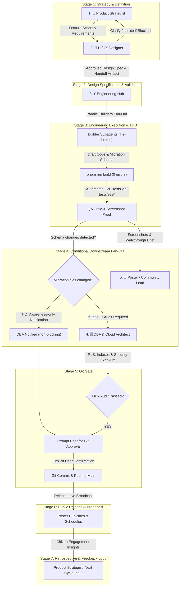

# 🌐 Multi-Agent Standard Operating Procedure (SOP)
## BrgyConnect Autonomous & Collaborative Engineering Lifecycle

This document defines the exact operational protocol, message handovers, quality gates, and safeguards across all 5 specialized AI conversations in **BrgyConnect**.

---

## 🏛️ Node Architecture & Identifiers

| Node # | Specialized Agent | Conversation ID | Primary Mandate |
| :---: | :--- | :--- | :--- |
| **1** | **🎯 Product Strategist** | `45ee6b25-d500-4f7a-958a-2c4ba1c88a77` | Roadmaps, citizen problem statements, feature scopes, and milestone prioritization. |
| **2** | **🎨 Lead Product Designer (UI/UX)** | `1ee4baed-7b22-40f0-a209-9a6a511bd8f3` | Component wireframes, visual hierarchy, mobile drawer ergonomics, touch targets (≥44px), and handoff artifacts. |
| **3** | **⚡ Engineering Hub** | `3544ab40-f53a-4478-938c-4ffadf8dc6b5` | Technical architecture, parallel builder fan-out, SSR validation, automated E2E browser tests, and release orchestration. |
| **4** | **🗄️ DBA & Cloud Architect** | `b1e2f794-7a77-49d6-ad06-adbd1b04aa1e` | Supabase PostgreSQL migrations, Row-Level Security (RLS), spatial indexing, and `SECURITY DEFINER` auditing. |
| **5** | **📢 Poster & Community Lead** | `1b7a4124-a255-4455-b698-7f87ffdf4d37` | Citizen engagement, Taglish community broadcasts, educational how-to guides, and Facebook launch campaigns. |

---

## 🔄 End-to-End 7-Stage Lifecycle Pipeline



---

## 📋 Detailed Stage Protocol

### 🎯 Stage 1: Product Strategy -> UI/UX Design
1. **Product Strategist** defines the milestone, user problem statement, and functional acceptance criteria.
2. Writes the product brief to the standard handoff directory (see Handoff Artifact Structure below).
3. Sends an inter-agent handoff message to **Lead Product Designer**.

### 🎨 Stage 2: UI/UX Design Specification & Validation
1. **Lead Product Designer** inspects the product requirements.
2. If ambiguities or UX blockers exist, iterates with **Product Strategist** to clarify before proceeding.
3. Formulates pixel-perfect component specifications, mobile responsiveness patterns, and color tokens into a structured design handoff artifact.
4. Sends the verified handoff artifact to **Engineering Hub**.

### ⚡ Stage 3: Engineering Execution & TDD
1. **Engineering Hub** ingests the design handoff and drafts `implementation_plan.md`.
2. Fans out dedicated parallel **Builder Subagents** (`Model: 'flash'`) with **explicit file-level ownership** (see Builder File-Lock Protocol below).
3. If new data fields are needed, Engineering drafts the initial SQL migration in `supabase/migrations/`.
4. Executes unified build validation: `npx --yes pnpm run build` (**0 errors mandatory**).
5. Runs automated E2E tests from `tests/e2e/` across desktop (1440px) and mobile (375px) viewports.
6. Updates `walkthrough.md` with screenshot carousels and Pass/Fail tables.

### 🗄️📢 Stage 4: Conditional Downstream Notification

**DBA notification is conditional based on whether schema/migration files were touched:**

1. **Schema-touching releases** (files changed in `supabase/migrations/`, new RLS policies, new tables/columns):
   - DBA audit is **mandatory and blocking**. Engineering must wait for DBA PASS sign-off before prompting the user for Git approval.
2. **UI-only releases** (no migration files changed):
   - DBA is notified for **awareness only** (non-blocking). Engineering may proceed directly to user Git approval.
3. **Poster** is always notified in parallel with the walkthrough brief and screenshot artifacts so Poster can begin drafting launch content.

**Detection method**: Run `git diff --cached --name-only | grep -c 'supabase/migrations'` to determine if schema files are staged.

### 🛡️ Stage 5: Git Gate & User Approval
1. If DBA audit was required, wait for official **PASS / Sign-Off**.
2. **Engineering Hub** prepares the Conventional Commit message and prompts the **User** for explicit approval.
3. Upon user confirmation, executes `git commit` and `git push origin main`.

### 🚀 Stage 6: Public Release & Community Broadcast
1. **Engineering Hub** notifies all nodes that the release is live on `main`.
2. **Poster** finalizes and publishes the community Facebook announcements and infographics.

### 🔁 Stage 7: Retrospective & Feedback Loop
1. **Poster** feeds citizen engagement insights back to **Product Strategist**:
   - Which features resonated most with residents?
   - What confusion or questions arose that suggest UX gaps?
   - Community feature requests that should inform the next milestone.
2. **Product Strategist** incorporates this feedback into the next cycle's roadmap.

---

## 🔒 Builder File-Lock Protocol

When Engineering Hub fans out parallel builder subagents, **each builder must have exclusive ownership of specific files**. No two builders may modify the same file.

### Rules:
1. The orchestrator's fan-out prompt must explicitly list which files each builder owns.
2. If a shared file (e.g., `__root.tsx`, a shared component) needs changes from multiple builders, **one builder is designated as primary owner**. The other builder reports its required changes as instructions to the orchestrator, who applies them sequentially after the primary builder completes.
3. If file ownership is ambiguous, the orchestrator must resolve it before fanning out.

### Example:
```
Builder A owns: src/routes/directory/index.tsx, src/components/directory/*
Builder B owns: src/routes/emergency.tsx
Builder C owns: src/routes/_authenticated/dashboard.tsx
Shared file (src/components/ui/card.tsx): Builder A is primary owner.
  Builder C reports card.tsx changes to orchestrator for sequential application.
```

---

## 📁 Standard Handoff Artifact Structure

All inter-node handoffs should follow a predictable directory structure so every agent knows where to find upstream work and where to write output:

```
handoffs/
├── YYYY-MM-DD_feature-slug/
│   ├── 01_product_brief.md        # Product Strategist output
│   ├── 02_design_spec.md          # UI/UX output
│   ├── 03_implementation_plan.md  # Engineering plan (user-approved)
│   ├── 04_walkthrough.md          # Engineering completion proof + screenshots
│   ├── 05_dba_audit.md            # DBA audit report (if schema-touching)
│   ├── 06_release_post.md         # Poster draft
│   └── screenshots/               # Visual verification artifacts
```

---

## 🚨 Stage 7b: Hotfix & Rollback Protocol

If a post-release regression is discovered after `git push`:

1. **Engineering Hub** immediately runs `git revert HEAD` and pushes the revert to `main`.
2. Opens a new pipeline cycle starting at **Stage 3** (Engineering) with the targeted fix.
3. **Poster** is notified to hold or retract any published announcements until the fix is released.
4. The fix follows the same conditional DBA gate and user approval before re-pushing.

---

## 🔄 Conversation Lifecycle & Knowledge Persistence

1. **Rotate conversations every 2–3 major milestones** to prevent context window exhaustion. Start a fresh Engineering Hub conversation pointing at the same `AGENTS.md` + `MULTI_AGENT_SOP.md`.
2. **Use `/learn` after solving non-obvious problems** (SSR edge cases, Supabase RLS patterns, Puppeteer SPA navigation quirks) to persist knowledge as permanent rules rather than relying on conversation memory.
3. **Conversation IDs in this document should be updated** when nodes are rotated.
