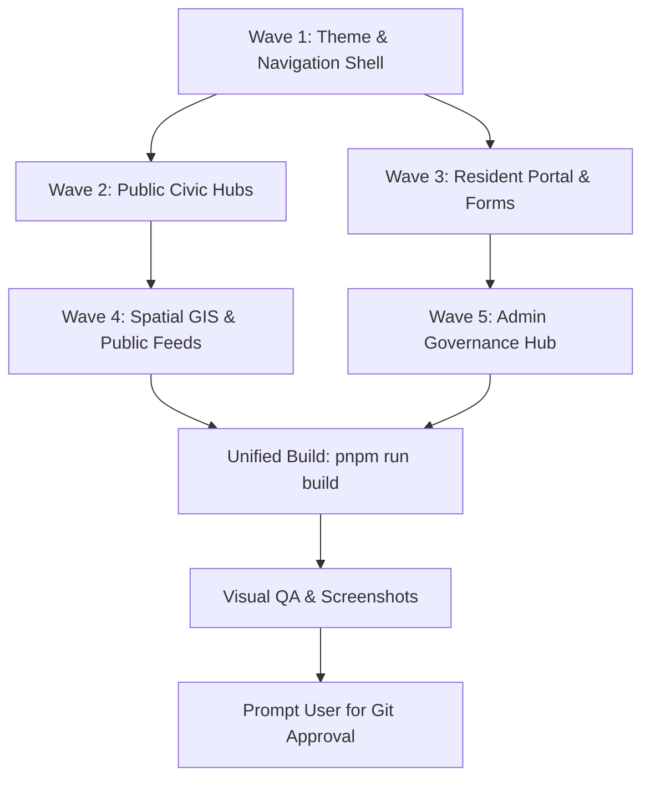

# 📦 Master Design Spec: Stitch "Civic Horizon" UI Overhaul
**Directory**: `handoffs/2026-08-28_stitch-ui-overhaul/02_design_spec.md`  
**From**: Lead Product Designer & Civic UI/UX Architect (Node 2)  
**To**: Engineering Hub (`3544ab40-f53a-4478-938c-4ffadf8dc6b5`) (Node 3)  
**Stitch Project**: [`13380625357118856621`](https://stitch.withgoogle.com) (`Civic Horizon` Token Asset `a599d2d627984cc58c9002acbed7d493`)  
**Target Codebase**: TanStack Start (SSR), Tailwind CSS v4, Radix UI Primitives, Lucide React, Leaflet Maps

---

## 🎯 Executive Overhaul Scope & Strategy

This comprehensive overhaul bridges our live codebase with the high-fidelity **Stitch "Civic Horizon" design system**, modernizing:
1. **Design Tokens & Theme Foundation**: Philippine Flag palette (`#0038A8` Royal Blue, `#CE1126` Crimson Red, `#FCD116` Golden Yellow, `#16A34A` Emerald Green), cool slate container backgrounds, and tactile bottom-inset button styling.
2. **Responsive Multi-Device Resilience**: Fluid adaptation across **Mobile (375px–390px)**, **Tablet (768px)**, and **Desktop (1280px–1440px+)**.
3. **5-Wave Phased Execution with Strict File-Lock Ownership**: Zero merge conflicts or file collisions across parallel builder subagents.

> [!IMPORTANT]
> **BRAND ASSET RULE — PRESERVE OFFICIAL LOGO (`/logo.jpg`) AS IS**:  
> The official Barangay Daine circular seal image at `/logo.jpg` must remain intact and unchanged across all screens (Navbar, Root Favicons, Digital Resident ID, Certificate Print Letterheads, Auth Pages, and Footer). Do not replace or modify `/logo.jpg`.

---

## 🎨 1. Global Design Tokens & Tailwind Utilities

```
┌─────────────────────────────────────────────────────────────────────────────┐
│ CIVIC HORIZON DESIGN TOKENS (Tailwind v4 Mapping)                          │
├─────────────────────────────────────────────────────────────────────────────┤
│ --color-primary          : #0038A8 (oklch: 0.40 0.18 265) — Royal Blue      │
│ --color-primary-dark     : #002576                                          │
│ --color-primary-light    : #1A52C8                                          │
│ --color-secondary        : #CE1126 (oklch: 0.44 0.22 27)  — Crimson Red     │
│ --color-accent           : #FCD116 (oklch: 0.88 0.18 85)  — Golden Yellow   │
│ --color-success          : #16A34A                        — Emerald Green   │
│ --color-info             : #0284C7                        — Sky Blue        │
│ --color-surface-slate    : #F8FAFC                                          │
│ --font-sans              : 'Plus Jakarta Sans', system-ui, sans-serif       │
│ --font-mono              : 'JetBrains Mono', Menlo, monospace               │
│                                                                             │
│ GLASSMORPHIC DOCK:                                                          │
│   backdrop-blur-md bg-white/10 dark:bg-slate-900/40 border border-white/20   │
│   shadow-xl rounded-2xl                                                     │
│                                                                             │
│ TACTILE BUTTON ELEVATION:                                                   │
│   shadow-[0_2px_0_0_rgba(0,0,0,0.15)] active:translate-y-0.5 transition-all │
│   min-h-[44px] (mobile) / min-h-[48px] (hero CTA)                          │
└─────────────────────────────────────────────────────────────────────────────┘
```

---

## 🌊 2. Multi-Agent Phased Execution Waves & File-Lock Matrix

To guarantee **zero merge conflicts** and parallel builder subagent safety, the overhaul is segmented into 5 sequential waves with mutually exclusive file locks:



---

### 🌊 WAVE 1: Theme Foundation & Navigation Shell
* **Builder Subagent**: `Builder-Shell` (Model: `flash`)
* **Exclusive File Locks**:
  - 🔒 [`src/styles.css`](file:///Users/markhuelgas/Documents/antigravity/ag-brgy-connect/src/styles.css)
  - 🔒 [`src/routes/__root.tsx`](file:///Users/markhuelgas/Documents/antigravity/ag-brgy-connect/src/routes/__root.tsx)
  - 🔒 [`src/components/layout/Navbar.tsx`](file:///Users/markhuelgas/Documents/antigravity/ag-brgy-connect/src/components/layout/Navbar.tsx)
  - 🔒 [`src/components/layout/Footer.tsx`](file:///Users/markhuelgas/Documents/antigravity/ag-brgy-connect/src/components/layout/Footer.tsx)
  - 🔒 [`src/components/emergency/EmergencySpeedDial.tsx`](file:///Users/markhuelgas/Documents/antigravity/ag-brgy-connect/src/components/emergency/EmergencySpeedDial.tsx)

#### Key Specifications:
1. **Global Styles**: Replace generic `Inter` with **`Plus Jakarta Sans`** for Display/Headings/Body and **`JetBrains Mono`** for tracking codes; define `.glass-dock` and `.btn-tactile` utilities.
2. **Navbar**: Standardize dual-scope selector pills (`All Daine`, `Daine 1`, `Daine 2`), responsive search dock (`⌘K`), and high-contrast dark/light mode toggle.
3. **Footer**: Official Republic of the Philippines letterhead badges, Indang Cavite municipal seals, and accessibility links.

---

### 🌊 WAVE 2: Public Civic Hubs
* **Parallel Builders**:
  - `Builder-Home`: 🔒 [`src/routes/index.tsx`](file:///Users/markhuelgas/Documents/antigravity/ag-brgy-connect/src/routes/index.tsx)
  - `Builder-Directory`: 🔒 [`src/routes/directory/index.tsx`](file:///Users/markhuelgas/Documents/antigravity/ag-brgy-connect/src/routes/directory/index.tsx), 🔒 [`src/routes/directory/$businessId.tsx`](file:///Users/markhuelgas/Documents/antigravity/ag-brgy-connect/src/routes/directory/$businessId.tsx)
  - `Builder-Emergency`: 🔒 [`src/routes/emergency.tsx`](file:///Users/markhuelgas/Documents/antigravity/ag-brgy-connect/src/routes/emergency.tsx)
  - `Builder-Tracker`: 🔒 [`src/routes/track.tsx`](file:///Users/markhuelgas/Documents/antigravity/ag-brgy-connect/src/routes/track.tsx)

#### Key Specifications:
1. **Landing Hub (`/`)**:
   - Stitch-inspired Dual-Zone Hero with ambient radial glow.
   - Glassmorphic Hero Instant Tracking Dock with monospace input and sample reference chips.
   - 4-Bento service cards with responsive hover elevation (`card-hover`).
2. **MSME Directory (`/directory`)**:
   - 16:9 storefront imagery, live "🟢 Open Now" pulsing badges.
   - Fixed 3-button footer: `[📞 Call]`, `[💬 Messenger]`, `[Details →]`.
   - Horizontal category pill carousel with count indicators.
3. **Emergency Hotlines (`/emergency`)**:
   - 4-Card Hero Speed-Dial Grid (`911`, `PNP`, `BFP`, `MDRRMO`) with 52px+ touch targets.
   - Offline Mode resilience banner.
4. **Public Tracker (`/track`)**:
   - 75% animated progress percentage bar & turnaround window estimator strip.
   - 4-Stage visual lifecycle stepper & 1-tap share link.

---

### 🌊 WAVE 3: Resident Portal & Self-Service Forms
* **Parallel Builders**:
  - `Builder-Dashboard`: 🔒 [`src/routes/_authenticated/dashboard.tsx`](file:///Users/markhuelgas/Documents/antigravity/ag-brgy-connect/src/routes/_authenticated/dashboard.tsx)
  - `Builder-DocRequest`: 🔒 [`src/routes/_authenticated/documents.request.tsx`](file:///Users/markhuelgas/Documents/antigravity/ag-brgy-connect/src/routes/_authenticated/documents.request.tsx), 🔒 [`src/components/documents/CertificatePrintModal.tsx`](file:///Users/markhuelgas/Documents/antigravity/ag-brgy-connect/src/components/documents/CertificatePrintModal.tsx)
  - `Builder-BlotterFiling`: 🔒 [`src/routes/_authenticated/complaints/new.tsx`](file:///Users/markhuelgas/Documents/antigravity/ag-brgy-connect/src/routes/_authenticated/complaints/new.tsx), 🔒 [`src/routes/_authenticated/complaints/$complaintId.tsx`](file:///Users/markhuelgas/Documents/antigravity/ag-brgy-connect/src/routes/_authenticated/complaints/$complaintId.tsx)
  - `Builder-MerchantOnboard`: 🔒 [`src/routes/_authenticated/businesses/new.tsx`](file:///Users/markhuelgas/Documents/antigravity/ag-brgy-connect/src/routes/_authenticated/businesses/new.tsx), 🔒 [`src/components/businesses/BusinessForm.tsx`](file:///Users/markhuelgas/Documents/antigravity/ag-brgy-connect/src/components/businesses/BusinessForm.tsx)
  - `Builder-ProfileAuth`: 🔒 [`src/routes/_authenticated/settings/profile.tsx`](file:///Users/markhuelgas/Documents/antigravity/ag-brgy-connect/src/routes/_authenticated/settings/profile.tsx), 🔒 [`src/routes/auth/sign-in.tsx`](file:///Users/markhuelgas/Documents/antigravity/ag-brgy-connect/src/routes/auth/sign-in.tsx), 🔒 [`src/routes/auth/sign-up.tsx`](file:///Users/markhuelgas/Documents/antigravity/ag-brgy-connect/src/routes/auth/sign-up.tsx)

#### Key Specifications:
1. **Resident Dashboard (`/dashboard`)**:
   - 3 Citizen KPI Summary Cards (Active Requests, Businesses, Blotter).
   - Digital Resident ID with holographic gradient, flip QR code, 2x2 photo slot, and export triggers.
   - Segmented document filter tabs with highlighted print action card.
2. **Document Request Wizard (`/documents/request`)**:
   - 2-Column form layout with auto-fill resident profile and live fee calculator (₱50 / Free).
3. **Blotter Desk (`/complaints/new`)**:
   - Confidential complaint wizard with anonymous whistleblowing switch and Lupon mediation process explainer sidebar.
4. **Certificate Print Modal (`CertificatePrintModal`)**:
   - Official municipal letterhead with dry seal area and verifiable QR stamp.

---

### 🌊 WAVE 4: Spatial GIS Map & Community Directories
* **Parallel Builders**:
  - `Builder-GISMap`: 🔒 [`src/routes/map/index.lazy.tsx`](file:///Users/markhuelgas/Documents/antigravity/ag-brgy-connect/src/routes/map/index.lazy.tsx), 🔒 [`src/routes/map/index.tsx`](file:///Users/markhuelgas/Documents/antigravity/ag-brgy-connect/src/routes/map/index.tsx)
  - `Builder-Feeds`: 🔒 [`src/routes/announcements/index.tsx`](file:///Users/markhuelgas/Documents/antigravity/ag-brgy-connect/src/routes/announcements/index.tsx), 🔒 [`src/routes/events/index.tsx`](file:///Users/markhuelgas/Documents/antigravity/ag-brgy-connect/src/routes/events/index.tsx), 🔒 [`src/routes/officials/index.tsx`](file:///Users/markhuelgas/Documents/antigravity/ag-brgy-connect/src/routes/officials/index.tsx), 🔒 [`src/routes/verify/$requestId.tsx`](file:///Users/markhuelgas/Documents/antigravity/ag-brgy-connect/src/routes/verify/$requestId.tsx)

#### Key Specifications:
1. **GIS Map (`/map`)**:
   - Slide-up bottom sheet on mobile (< 768px) and split-view on tablet (768px).
   - "🚨 Nearest Evacuation Shelter" FAB that calculates nearest shelter and auto-centers the map.
   - Turn-by-turn Google Maps direction buttons.
2. **Officials & Public Feeds**:
   - Executive spotlight cards with consultation hours and committee badges.
   - Pinned high-priority weather/disaster bulletin banner.

---

### 🌊 WAVE 5: Admin Executive Console & Governance Hub
* **Parallel Builders**:
  - `Builder-AdminLayout`: 🔒 [`src/routes/_authenticated/admin.tsx`](file:///Users/markhuelgas/Documents/antigravity/ag-brgy-connect/src/routes/_authenticated/admin.tsx), 🔒 [`src/routes/_authenticated/admin/index.lazy.tsx`](file:///Users/markhuelgas/Documents/antigravity/ag-brgy-connect/src/routes/_authenticated/admin/index.lazy.tsx)
  - `Builder-AdminTriage`: 🔒 [`src/routes/_authenticated/admin/documents.tsx`](file:///Users/markhuelgas/Documents/antigravity/ag-brgy-connect/src/routes/_authenticated/admin/documents.tsx), 🔒 [`src/routes/_authenticated/admin/complaints.tsx`](file:///Users/markhuelgas/Documents/antigravity/ag-brgy-connect/src/routes/_authenticated/admin/complaints.tsx)
  - `Builder-AdminMgmt`: 🔒 [`src/routes/_authenticated/admin/businesses.tsx`](file:///Users/markhuelgas/Documents/antigravity/ag-brgy-connect/src/routes/_authenticated/admin/businesses.tsx), 🔒 [`src/routes/_authenticated/admin/emergency.tsx`](file:///Users/markhuelgas/Documents/antigravity/ag-brgy-connect/src/routes/_authenticated/admin/emergency.tsx), 🔒 [`src/routes/_authenticated/admin/users.tsx`](file:///Users/markhuelgas/Documents/antigravity/ag-brgy-connect/src/routes/_authenticated/admin/users.tsx)

#### Key Specifications:
1. **Admin Navigation**: Fixed 4-Tab Bottom App Bar on mobile (`Overview`, `Documents`, `Blotter`, `More...`) + Radix Sheet drawer for sub-modules.
2. **Document Triage Table**: High-density clearance queue with 1-click status update and digital certification stamping.
3. **Blotter Mediation**: Case schedule manager and summons notice generation.

---

## 🧪 Acceptance Criteria & Build Gates

- [ ] **Compilation**: `pnpm run build` passes with **0 TypeScript, Vite SSR, and Nitro compilation errors**.
- [ ] **Touch Targets**: All interactive elements maintain $\ge 44\text{px}$ (mobile) and $\ge 48\text{px}$ (hotlines/hero actions).
- [ ] **Dual-Barangay Scoping**: Daine 1 and Daine 2 filters function seamlessly across all views.
- [ ] **Visual Testing**: Automated Puppeteer captures for Mobile (375px/390px), Tablet (768px), and Desktop (1440px).
