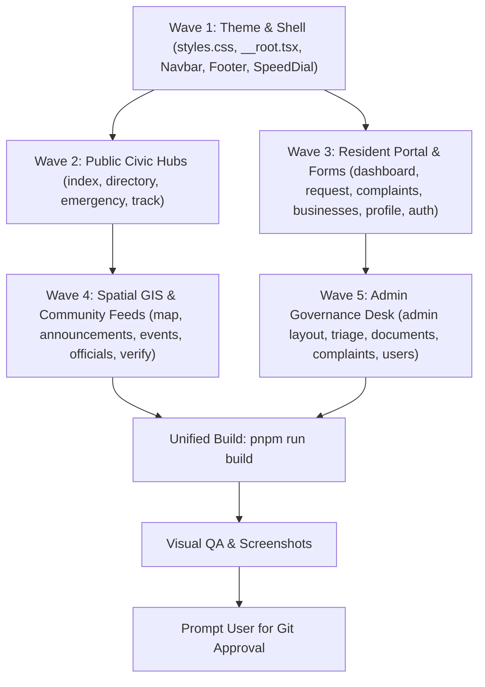

# 🎨 Engineering Implementation Plan: Stitch "Civic Horizon" UI Overhaul

**Directory**: `handoffs/2026-08-28_stitch-ui-overhaul/03_implementation_plan.md`  
**Specification Reference**: [`handoffs/2026-08-28_stitch-ui-overhaul/02_design_spec.md`](file:///Users/markhuelgas/Documents/antigravity/ag-brgy-connect/handoffs/2026-08-28_stitch-ui-overhaul/02_design_spec.md)  
**Project**: Stitch Project `13380625357118856621` (`Civic Horizon` Token Asset `a599d2d627984cc58c9002acbed7d493`)  
**Architecture**: TanStack Start (SSR), Tailwind CSS v4, Radix UI Primitives, Lucide React, Leaflet GIS  
**Execution Model**: 5-Wave Phased Execution with Strict Subagent File-Lock Ownership

---

## 🎯 Overhaul Summary & Objectives

This implementation plan coordinates the end-to-end modernization of **BrgyConnect** to match the high-fidelity **Stitch "Civic Horizon"** design specification:
1. **Design Tokens & Theme System**: Standardize Philippine Civic Palette (`#0038A8` Royal Blue, `#CE1126` Crimson Red, `#FCD116` Golden Yellow, `#16A34A` Emerald Green), cool slate container backgrounds, glassmorphic docks, and tactile button styling (`btn-tactile`).
2. **Multi-Device Responsiveness**: Fluid adaptation across **Mobile (375px/390px)**, **Tablet (768px)**, and **Desktop (1280px/1440px+)** with touch target compliance ($\ge 44\text{px}$).
3. **Zero Regressions & Zero Build Failures**: Every phase verified with `pnpm run build` (0 TypeScript, Vite SSR, and Nitro compilation errors) and visual Puppeteer screenshot audits.
4. **Conditional DBA Gate**: Zero database schema changes (UI-only release; DBA notified for awareness, non-blocking).

---

## 🔒 Phased Execution Waves & Exclusive File-Lock Matrix

---

### 🌊 Wave 1: Theme Foundation & Navigation Shell
* **Builder Subagent**: `builder_wave1_shell` (Model: `flash`)
* **Exclusive File Locks**:
  - 🔒 [`src/styles.css`](file:///Users/markhuelgas/Documents/antigravity/ag-brgy-connect/src/styles.css)
  - 🔒 [`src/routes/__root.tsx`](file:///Users/markhuelgas/Documents/antigravity/ag-brgy-connect/src/routes/__root.tsx)
  - 🔒 [`src/components/layout/Navbar.tsx`](file:///Users/markhuelgas/Documents/antigravity/ag-brgy-connect/src/components/layout/Navbar.tsx)
  - 🔒 [`src/components/layout/Footer.tsx`](file:///Users/markhuelgas/Documents/antigravity/ag-brgy-connect/src/components/layout/Footer.tsx)
  - 🔒 [`src/components/emergency/EmergencySpeedDial.tsx`](file:///Users/markhuelgas/Documents/antigravity/ag-brgy-connect/src/components/emergency/EmergencySpeedDial.tsx)

#### Tasks:
1. `src/styles.css`: Add Stitch `.glass-dock` utility, `.btn-tactile` press feedback, and Courier Prime monospace token for reference codes.
2. `src/routes/__root.tsx`: Ensure font stylesheets, preconnect links, and theme root classes match Civic Horizon.
3. `src/components/layout/Navbar.tsx`: Refine dual-scope selector pills (`All Daine`, `Daine 1`, `Daine 2`), Command-K search pill, and high-contrast dark/light mode toggles.
4. `src/components/layout/Footer.tsx`: Add Republic of the Philippines letterhead badges, Indang Cavite municipal seals, and accessibility links.
5. `src/components/emergency/EmergencySpeedDial.tsx`: 52px tactile floating speed-dial trigger with expanded high-contrast action list.

---

### 🌊 Wave 2: Public Civic Hubs
* **Parallel Subagents**:
  - `builder_wave2_home`: 🔒 [`src/routes/index.tsx`](file:///Users/markhuelgas/Documents/antigravity/ag-brgy-connect/src/routes/index.tsx)
  - `builder_wave2_directory`: 🔒 [`src/routes/directory/index.tsx`](file:///Users/markhuelgas/Documents/antigravity/ag-brgy-connect/src/routes/directory/index.tsx), 🔒 [`src/routes/directory/$businessId.tsx`](file:///Users/markhuelgas/Documents/antigravity/ag-brgy-connect/src/routes/directory/$businessId.tsx)
  - `builder_wave2_emergency`: 🔒 [`src/routes/emergency.tsx`](file:///Users/markhuelgas/Documents/antigravity/ag-brgy-connect/src/routes/emergency.tsx)
  - `builder_wave2_tracker`: 🔒 [`src/routes/track.tsx`](file:///Users/markhuelgas/Documents/antigravity/ag-brgy-connect/src/routes/track.tsx)

#### Tasks:
1. `index.tsx`: Dual-Zone Hero with radial glow, Glassmorphic Hero Instant Tracking Dock, and 4-Bento service cards.
2. `directory/`: 16:9 storefront cards, live "🟢 Open Now" pulsing indicators, horizontal category pill carousel, and 3-button actions.
3. `emergency.tsx`: 4-Card Hero Speed-Dial Grid (`911`, `PNP`, `BFP`, `MDRRMO`) with 52px+ touch targets and offline banner.
4. `track.tsx`: Dynamic percentage bar, turnaround estimator window, 4-stage lifecycle stepper, and 1-tap share link.

---

### 🌊 Wave 3: Resident Portal & Self-Service Forms
* **Parallel Subagents**:
  - `builder_wave3_dashboard`: 🔒 [`src/routes/_authenticated/dashboard.tsx`](file:///Users/markhuelgas/Documents/antigravity/ag-brgy-connect/src/routes/_authenticated/dashboard.tsx)
  - `builder_wave3_doc_request`: 🔒 [`src/routes/_authenticated/documents.request.tsx`](file:///Users/markhuelgas/Documents/antigravity/ag-brgy-connect/src/routes/_authenticated/documents.request.tsx), 🔒 [`src/components/documents/CertificatePrintModal.tsx`](file:///Users/markhuelgas/Documents/antigravity/ag-brgy-connect/src/components/documents/CertificatePrintModal.tsx)
  - `builder_wave3_complaints`: 🔒 [`src/routes/_authenticated/complaints/new.tsx`](file:///Users/markhuelgas/Documents/antigravity/ag-brgy-connect/src/routes/_authenticated/complaints/new.tsx), 🔒 [`src/routes/_authenticated/complaints/$complaintId.tsx`](file:///Users/markhuelgas/Documents/antigravity/ag-brgy-connect/src/routes/_authenticated/complaints/$complaintId.tsx)
  - `builder_wave3_businesses`: 🔒 [`src/routes/_authenticated/businesses/new.tsx`](file:///Users/markhuelgas/Documents/antigravity/ag-brgy-connect/src/routes/_authenticated/businesses/new.tsx), 🔒 [`src/components/businesses/BusinessForm.tsx`](file:///Users/markhuelgas/Documents/antigravity/ag-brgy-connect/src/components/businesses/BusinessForm.tsx)
  - `builder_wave3_auth_profile`: 🔒 [`src/routes/_authenticated/settings/profile.tsx`](file:///Users/markhuelgas/Documents/antigravity/ag-brgy-connect/src/routes/_authenticated/settings/profile.tsx), 🔒 [`src/routes/auth/sign-in.tsx`](file:///Users/markhuelgas/Documents/antigravity/ag-brgy-connect/src/routes/auth/sign-in.tsx), 🔒 [`src/routes/auth/sign-up.tsx`](file:///Users/markhuelgas/Documents/antigravity/ag-brgy-connect/src/routes/auth/sign-up.tsx)

#### Tasks:
1. `dashboard.tsx`: 3 Citizen KPI Summary Cards, Holographic Digital Resident ID Card with flip QR & 2x2 photo slot, segmented document tabs.
2. `documents.request.tsx`: 2-Column form layout with auto-fill resident profile and live fee calculation.
3. `CertificatePrintModal.tsx`: Official municipal letterhead with dry seal area and verifiable QR stamp.
4. `complaints/new.tsx`: Confidential complaint wizard with anonymous toggle and Lupon mediation process explainer sidebar.
5. `businesses/new.tsx`: GPS Purok coordinate picker and MSME storefront photo uploader.

---

### 🌊 Wave 4: Spatial GIS Map & Community Directories
* **Parallel Subagents**:
  - `builder_wave4_map`: 🔒 [`src/routes/map/index.lazy.tsx`](file:///Users/markhuelgas/Documents/antigravity/ag-brgy-connect/src/routes/map/index.lazy.tsx), 🔒 [`src/routes/map/index.tsx`](file:///Users/markhuelgas/Documents/antigravity/ag-brgy-connect/src/routes/map/index.tsx)
  - `builder_wave4_feeds`: 🔒 [`src/routes/announcements/index.tsx`](file:///Users/markhuelgas/Documents/antigravity/ag-brgy-connect/src/routes/announcements/index.tsx), 🔒 [`src/routes/events/index.tsx`](file:///Users/markhuelgas/Documents/antigravity/ag-brgy-connect/src/routes/events/index.tsx), 🔒 [`src/routes/officials/index.tsx`](file:///Users/markhuelgas/Documents/antigravity/ag-brgy-connect/src/routes/officials/index.tsx), 🔒 [`src/routes/verify/$requestId.tsx`](file:///Users/markhuelgas/Documents/antigravity/ag-brgy-connect/src/routes/verify/$requestId.tsx)

#### Tasks:
1. `map/`: Slide-up bottom sheet on mobile (< 768px), "🚨 Nearest Evacuation Shelter" FAB, turn-by-turn directions button.
2. `officials/`, `announcements/`, `events/`: Spotlight cards, consultation schedules, committee tags, and pinned emergency bulletins.

---

### 🌊 Wave 5: Admin Executive Console & Governance Hub
* **Parallel Subagents**:
  - `builder_wave5_admin_layout`: 🔒 [`src/routes/_authenticated/admin.tsx`](file:///Users/markhuelgas/Documents/antigravity/ag-brgy-connect/src/routes/_authenticated/admin.tsx), 🔒 [`src/routes/_authenticated/admin/index.lazy.tsx`](file:///Users/markhuelgas/Documents/antigravity/ag-brgy-connect/src/routes/_authenticated/admin/index.lazy.tsx)
  - `builder_wave5_admin_triage`: 🔒 [`src/routes/_authenticated/admin/documents.tsx`](file:///Users/markhuelgas/Documents/antigravity/ag-brgy-connect/src/routes/_authenticated/admin/documents.tsx), 🔒 [`src/routes/_authenticated/admin/complaints.tsx`](file:///Users/markhuelgas/Documents/antigravity/ag-brgy-connect/src/routes/_authenticated/admin/complaints.tsx)
  - `builder_wave5_admin_mgmt`: 🔒 [`src/routes/_authenticated/admin/businesses.tsx`](file:///Users/markhuelgas/Documents/antigravity/ag-brgy-connect/src/routes/_authenticated/admin/businesses.tsx), 🔒 [`src/routes/_authenticated/admin/emergency.tsx`](file:///Users/markhuelgas/Documents/antigravity/ag-brgy-connect/src/routes/_authenticated/admin/emergency.tsx), 🔒 [`src/routes/_authenticated/admin/users.tsx`](file:///Users/markhuelgas/Documents/antigravity/ag-brgy-connect/src/routes/_authenticated/admin/users.tsx)

#### Tasks:
1. `admin.tsx`: Fixed 4-Tab Bottom App Bar on mobile (`Overview`, `Documents`, `Blotter`, `More...`) + Radix Sheet drawer.
2. `admin/documents.tsx`: High-density clearance queue with 1-click status update and digital certification stamping.
3. `admin/complaints.tsx`: Case schedule manager and summons notice generation.

---

## 🧪 Verification Plan

### Automated Build & Type Checking:
- Run `npx --yes pnpm run build` after each wave to ensure 0 TypeScript and SSR compilation errors.

### Visual Proof & QA Audits:
- Run `scripts/qa-major-ui-audit.mjs` to capture high-res desktop (1440px), tablet (768px), and mobile (375px/390px) screenshots across all revamped routes.
- Verify Lighthouse scores maintain 100/100 across Accessibility, Best Practices, SEO, and PWA.

### Release Gate:
- Confirm UI-only status (no migration changes).
- Prompt user for explicit Git confirmation before pushing to `main`.
