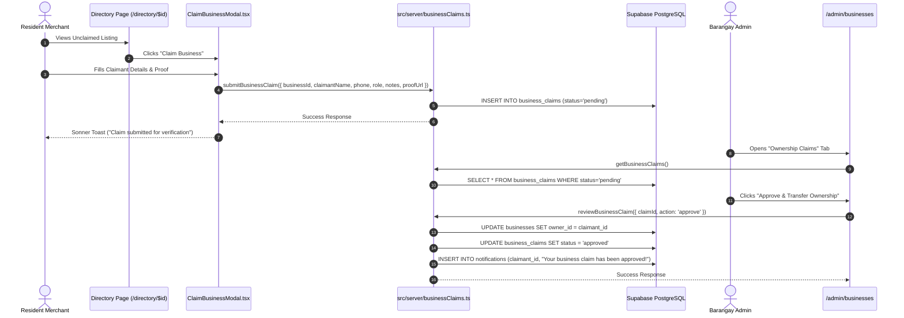

# ⚡ Stage 3: Engineering Implementation Plan — MSME Business Ownership Claiming

> **Feature Name**: MSME Business Ownership Claiming Workflow  
> **Lifecycle Stage**: Stage 3 (Engineering Architecture & File-Lock Plan)  
> **Engine**: Engine 1 (Parallel Builder Fan-Out with File-Locking)  
> **Author**: Node 3A (🧭 Lead Architect)  
> **Inputs**: `handoffs/2026-09-01_msme-business-claiming/02_design_spec.md`

---

## 🏗️ 1. Technical Architecture & Data Flow

---

## 🔒 2. File-Lock Assignments

1. **🔒 Lock 1**: `supabase/migrations/20240126000001_business_claims_schema.sql`
   - Creates `business_claims` table with `id`, `business_id`, `claimant_id`, `claimant_name`, `claimant_phone`, `relationship`, `proof_notes`, `proof_image_url`, `status` (`pending`, `approved`, `rejected`), `admin_notes`, `reviewed_by`, `reviewed_at`, `created_at`, `updated_at`.
   - Adds RLS policies for claimant insertion/view and admin management.
   - Adds index on `business_claims(business_id, status)` and `business_claims(claimant_id)`.

2. **🔒 Lock 2**: `src/server/businessClaims.ts`
   - `submitBusinessClaim`: Validates input with Zod, checks user authentication, checks that business is unclaimed or existing claims are handled, inserts into `business_claims`.
   - `getBusinessClaims`: Fetches claims scoped by admin barangay unit.
   - `reviewBusinessClaim`: Handles `approve` (transfers `businesses.owner_id`, marks claim approved, creates resident notification) and `reject` (marks claim rejected with admin notes).

3. **🔒 Lock 3**: `src/components/businesses/ClaimBusinessModal.tsx`
   - Tactile Radix Dialog with form validation, claimant role selector, proof upload, and Sonner toast.

4. **🔒 Lock 4**: `src/routes/directory/$businessId.tsx` & `src/routes/directory/index.tsx`
   - Checks `!business.owner_id` to show the unclaimed status badge and render `<ClaimBusinessModal />`.

5. **🔒 Lock 5**: `src/routes/_authenticated/admin/businesses.tsx`
   - Integrates the new **"Ownership Claims"** tab with count badge, claims table, and interactive review modal.

---

## 🧪 3. Verification Plan
- **Unified Build**: `npx --yes pnpm run build` (0 TypeScript, Vite SSR, and Nitro errors).
- **Automated QA**: Puppeteer script verifying:
  1. Unclaimed badge rendering on `/directory` and `/directory/$id`.
  2. Modal opens and form controls respond with $\ge 44\text{px}$ touch targets.
  3. Admin console renders the Claims tab.
- **Screenshots**: Desktop and mobile captures saved to artifact directory.
